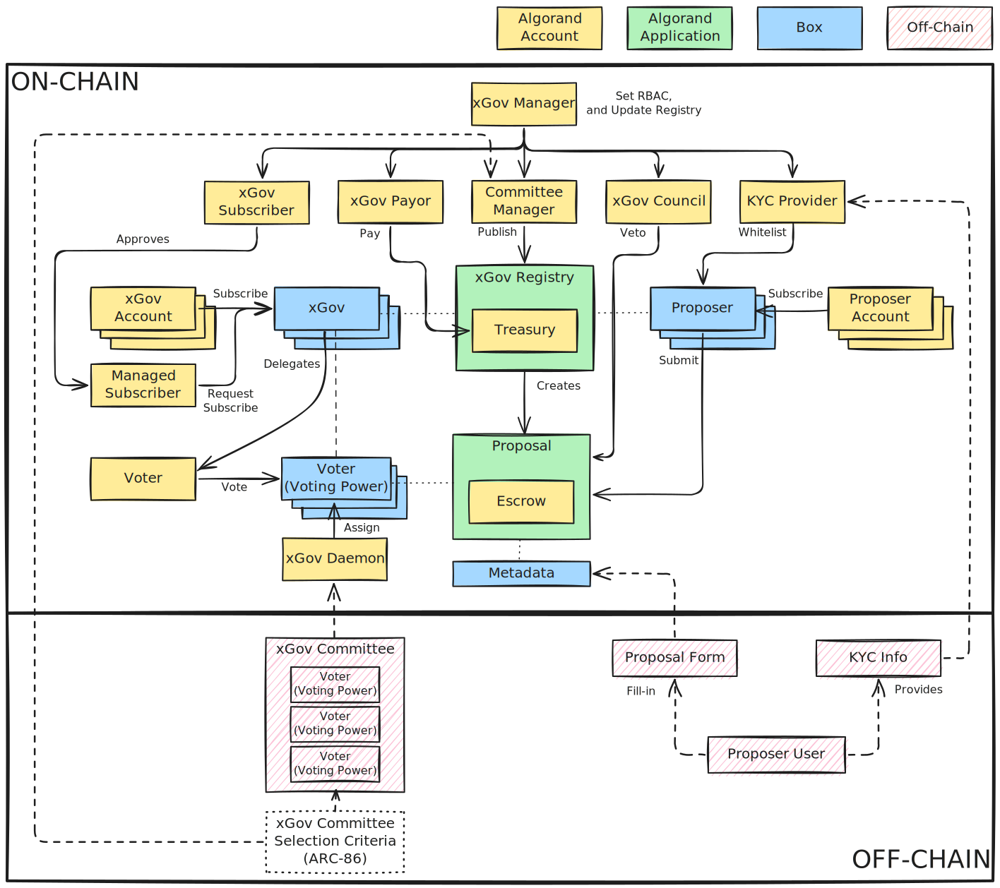

# Architecture Overview

The xGov Architecture consists of the following components:

| COMPONENT                                                                   | IMPLEMENTATION                  |
|:----------------------------------------------------------------------------|:--------------------------------|
| [xGov Portal](https://xgov.algorand.co/)                                    | Front-End                       |
| [xGov Registry](./specs/xgov-registry.md)                                   | Algorand Application (Factory)  |
| [xGov Treasury](./specs/xgov-treasury.md)                                   | Algorand Application Account    |
| [xGov Manager](./specs/xgov-rbac.md#xgov-manager)                           | Algorand Address                |
| [xGov Committee Manager](./specs/xgov-rbac.md#xgov-committee-manager)       | Algorand Address                |
| [xGov Daemon](./specs/xgov-rbac.md#xgov-daemon)                             | Algorand Address, Back-End + DB |
| [xGov Council](./specs/xgov-rbac.md#xgov-council)                           | Algorand Address                |
| [xGov Payor](./specs/xgov-rbac.md#xgov-payor)                               | Algorand Address                |
| [xGov Subscriber](./specs/xgov-rbac.md#xgov-subscriber)                     | Algorand Address                |
| [xGov](./specs/xgovs.md)                                                    | Algorand Address + Box          |
| [Managed Subscriber](./specs/xgovs.md#subscription)                         | Algorand Address                |
| [xGov (Un)Subscription Request](./specs/xgovs.md#xgov-managed-subscription) | Box                             |
| [xGov Committee](./specs/xgov-committee.md)                                 | JSON (ARC-86)                   |
| [Proposer](./specs/proposers.md)                                            | Algorand Address + Box          |
| [KYC Provider](./specs/proposers.md#kyc)                                    | Algorand Address                |
| [Proposal](./specs/proposal.md)                                             | Algorand Application (Child)    |
| [Proposal Metadata](./specs/proposal.md#metadata)                           | Box                             |
| [Proposal Escrow](./specs/proposal.md#escrow)                               | Algorand Application Account    |
| [Proposal Voters](./specs/proposal-submission.md#submission)                | Boxes                           |

The _on-chain_ components are used for:

1. On/off-boarding xGovs;
1. Whitelisting Proposers (KYC required);
1. Creating and submitting Proposals;
1. Binding xGov Committees to Proposals;
1. Voting on Proposals;
1. Managing the xGov Treasury and funding approved Proposals.

The _off-chain_ components are used for:

1. Selecting xGov Committees periodically and verifiably, according to [ARC-86](https://dev.algorand.co/arc-standards/arc-0086);
1. Intermediate Proposers’ KYC;
1. Intermediate on/off-boarding of xGovs that cannot execute a self-subscription
or self-unsubscription.
