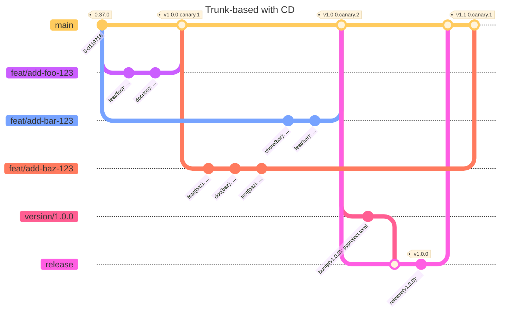

# CI/CD

## Branch Management

### Protected Branches

- `main` (default), the _trunk_
- `release`

The trunk is considered _stable_ and **MUST**:

- Reject commits not included in a Pull Request
- Require Docs and TestNet deployments to be healthy to accept commits from `release`
- Meet the quality criteria defined in the CI/CD pipeline

The `release` branch **MUST**:

- Be kept in sync with `main`
- Be used to generate release tags
- Reject commits from branches other than `main` that are:
  - Not included in a Pull Request
  - Have a `diff` that is not strictly equal to the `pyproject.toml` version bump.

The CI/CD pipeline ensures that:

- The `main` branch contains release-grade code at any time (both for Smart Contracts
and Docs)

- The `release` branch is synced with `main` and used only to generate release tags
(reflected as `pyproject.toml` version)

### Unprotected Branches

Features, major refactoring, dependency bumps, or bugfixes **SHALL** be carried
out on a dedicated unprotected branch pointing to the trunk (`main`).

The `pyproject.toml` release version bumps **SHALL** be carried out on a dedicated
unprotected branch pointing to the `release` branch.

Draft Pull Requests from unprotected branches, either to `main` or `release`, **SHOULD**
skip the CI.

## Deployments

The CD makes use of the following deployment environments:

- `github-pages`: to host the static documentation (mdBook)

- `contract-testnet`: to continuously deploy Smart Contracts to the Algorand TestNet

- `contract-mainnet`: to deploy Smart Contracts to the Algorand MainNet on release

## Implementation

The CI/CD pipeline is implemented with the following _automated_ workflows:

- Smart Contracts CI (tests, lint, output stability, mock deployment)
- Smart Contracts CD (to TestNet)

- Documentation CI (tests, lint)
- Documentation CD (to <https://docs.xgov.algorand.co/>)

- Release CI (validate release tag, version, etc.)
- Release (to MainNet)

And the following _manually dispatchable_ workflows:

- PR previews for external contributions
- xGov Registry parameters configuration
- xGov Registry RBAC management
- Pause and Resume Proposals
- Release and Update xGov Council
