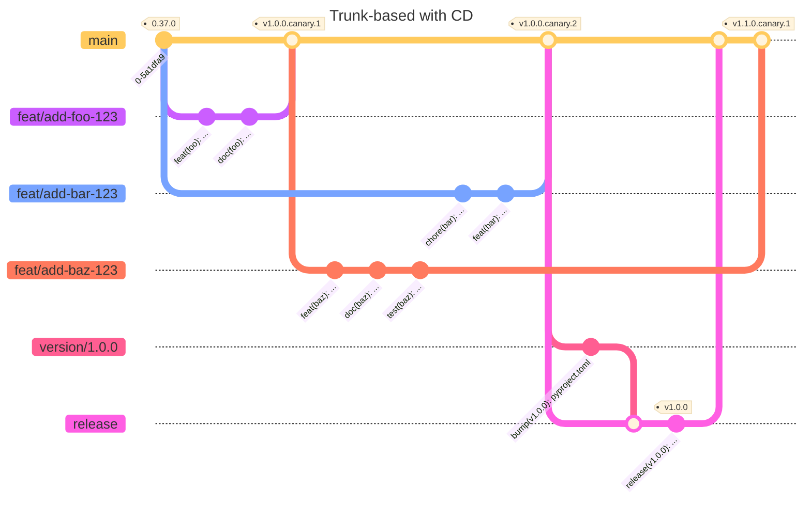

# CI/CD

## Branch Management


```mermaid
---
title: Trunk-based with CD
---
%%{init: { 'logLevel': 'debug', 'theme': 'base', 'gitGraph': {'showBranches': true, 'showCommitLabel':true,'mainBranchName': 'main'}} }%%
gitGraph
   commit tag: "0.37.0"

   branch "feat/add-foo-123"
   branch "feat/add-bar-123"

   checkout "feat/add-foo-123"
   commit id: "feat(foo): ..."
   commit id: "doc(foo): ..."
   checkout main
   merge "feat/add-foo-123" tag: "v1.0.0.canary.1"

   branch "feat/add-baz-123"
   commit id: "feat(baz): ..."
   commit id: "doc(baz): ..."
   commit id: "test(baz): ..."

   checkout "feat/add-bar-123"
   commit id: "chore(bar): ..."
   commit id: "feat(bar): ..."
   checkout main
   merge "feat/add-bar-123" tag: "v1.0.0.canary.2"

   checkout main
   branch "version/1.0.0"
   commit id: "bump(v1.0.0): pyproject.toml"

   checkout main
   branch release
   merge "version/1.0.0"
   commit id: "release(v1.0.0): ..." tag: "v1.0.0"

   checkout main
   merge release
   checkout main
   merge "feat/add-baz-123" tag: "v1.1.0.canary.1"
```

### Protected Branches

- `main` (default), the _trunk_
- `release`

The trunk is considered _stable_ and **MUST**:

- Reject commits not included in a Pull Request
- Reject commits from branches other than `release` that have a `diff` on the `pyproject.toml`
version bump
- Require Docs and TestNet deployments to be healthy to accept commits from `release`
- Meet the quality criteria defined in the CI/CD pipeline

The `release` branch **MUST**:

- Be kept in sync with `main`
- Be used to generate release tags
- Reject commits from branches other than `main` that are:
  - Not included in a Pull Request
  - Have a `diff` that is not strictly equal to the `pyproject.toml` version bump.

The CI/CD pipeline ensures that:

- The `main` branch contains release-grade code at any time (both for Smart Contracts
and Docs)

- The `release` branch is synced with `main` and used only to generate release tags
(reflected as `pyproject.toml` version)

### Unprotected Branches

Features, major refactoring, dependency bumps, or bugfixes **SHALL** be carried
out on a dedicated unprotected branch pointing to the trunk (`main`).

The `pyproject.toml` release version bumps **SHALL** be carried out on a dedicated
unprotected branch pointing to the `release` branch.

Draft Pull Requests from unprotected branches, either to `main` or `release`, **SHOULD**
skip the CI.

## Deployments

The CD makes use of the following deployment environments:

- `preview`: to host the static documentation (mdBook)

- `contract-testnet`: to continuously deploy Smart Contracts to the Algorand TestNet

- `contract-mainnet`: to deploy Smart Contracts to the Algorand MainNet on release

## Implementation

The CI/CD pipeline is implemented with the following _automated_ workflows:

- Smart Contracts CI (tests, lint, output stability, mock deployment)
- Smart Contracts CD (to TestNet)
- xGov Registry committee publisher (to MainNet)
- xGov Registry committee watchdog (MainNet freshness checks)

- Documentation CI (tests, lint, preview)

- Release CI (validate release tag, version, etc.)
- Release (to MainNet)

And the following _manually dispatchable_ workflows:

- Documentation preview for external contributions
- Documentation deployment (to <https://docs.xgov.algorand.co/>)
- xGov Registry parameters configuration
- xGov Registry RBAC management
- xGov Registry/Proposals pause and resume
- xGov Registry committee publisher
- Release and Update xGov Council

## Committee Publishing

The xGov Registry committee publication flow is implemented as a dedicated CI/CD
feature.

### MainNet publisher

The automated MainNet publisher workflow:

- Fetches the xGov Registry global state.
- Reads `committee_last_anchor` and `governance_period` from the global state.
- Computes the target anchor as the latest round aligned to the current
  `governance_period`.
- Fetches the committee entry from `COMMITTEE_INDEX_URL`.
- Publishes the next committee only when:
  - the Registry is behind the target anchor
  - the committee entry exists in the index
  - `committeeId`, `totalMembers`, and `totalVotes` are valid

The public pre-check is implemented by `.github/scripts/committee-precheck.sh` and
uses only `curl` and `jq`. This allows the workflow to skip AlgoKit and Python dependency
installation when the Registry is already up to date.

When publication is required, the workflow invokes:

```bash
algokit project deploy mainnet xgov_registry
```

with:

- `XGOV_REG_DEPLOY_COMMAND=declare_committee`
- `XGOV_REG_COMMITTEE_ID_B64`
- `XGOV_REG_COMMITTEE_TOTAL_MEMBERS`
- `XGOV_REG_COMMITTEE_TOTAL_VOTES`
- `XGOV_REG_EXPECTED_TARGET_ANCHOR`

### MainNet watchdog

The automated MainNet watchdog workflow uses the same public pre-check inputs but
never installs AlgoKit and never sends transactions.

It raises an alert when:

- `target_anchor > committee_last_anchor`
- `last_round >= target_anchor + 5000`

The watchdog opens or updates a GitHub issue for the overdue anchor and closes it
automatically after the Registry catches up.

### TestNet integration

The TestNet committee workflow is intentionally manual only. It is used as an integration
test for the `declare_committee` deploy command.

The TestNet run:

- Reads rounds and Registry state from `ALGOD_API_BASE_TESTNET`
- Resolves `committeeId` from `COMMITTEE_INDEX_URL`
- Uses manual workflow inputs for `committee_members` and `committee_votes`, or
  defaults them to `30` and `9000000`
- Calls:

```bash
algokit project deploy testnet xgov_registry
```

with `XGOV_REG_DEPLOY_COMMAND=declare_committee`

### GitHub Variables

The committee publication workflows require the following GitHub variables:

- `COMMITTEE_INDEX_URL`
- `ALGOD_API_BASE_MAINNET`
- `ALGOD_API_BASE_TESTNET`
- `XGOV_REGISTRY_ID_MAINNET`
- `XGOV_REGISTRY_ID_TESTNET`
